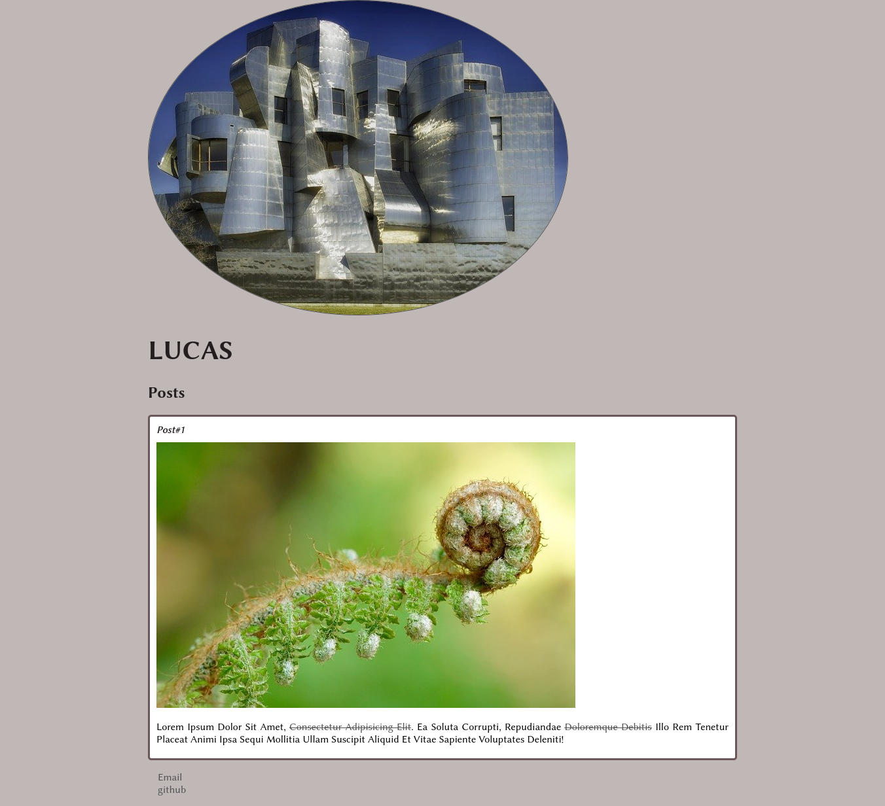

# What is it all about?
It is just a basic course demonstrating some primary concepts of html and css using a practical example. In this case, I used random images from google, after all, this is just an exercise:
